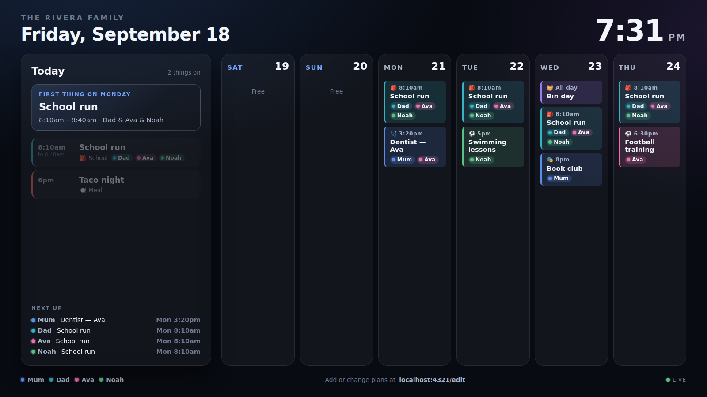
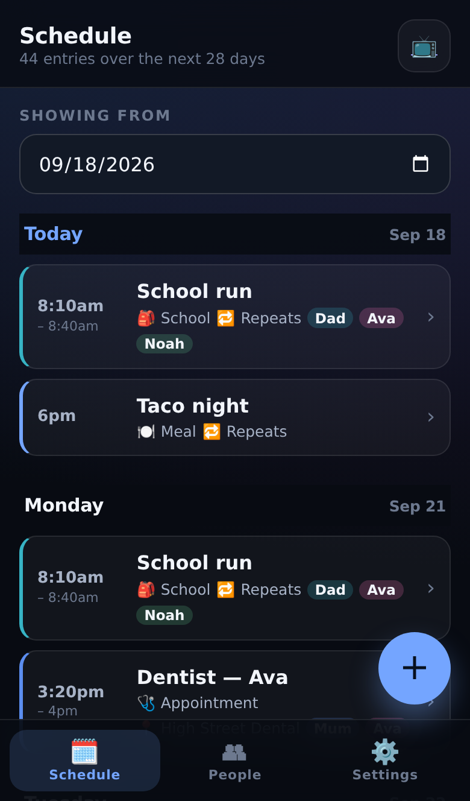
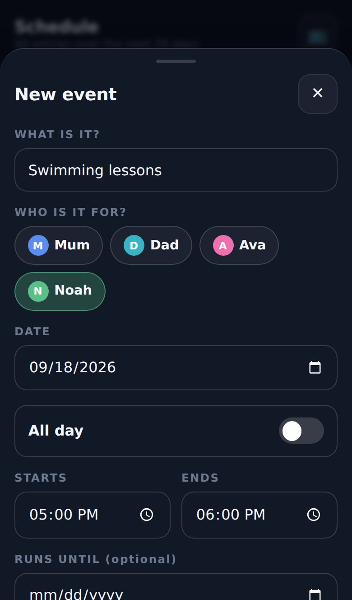

# Hearth

A family calendar that lives on the kitchen TV, with an editor built for the
phone in your pocket.

Open `/` on any TV browser and leave it there: a glanceable board of today and
the week ahead, colour-coded per person, that updates itself the moment anyone
changes anything. Open `/edit` on a phone to add the dentist appointment while
you're still on the call.



<p align="center">
  
  
</p>

| TV display (`/`) | Phone editor (`/edit`) |
| --- | --- |
| Today's agenda, what's happening now, what's next | Add, edit and delete in a couple of taps |
| Six days ahead, or a full-week board | Repeat rules without the iCal jargon |
| Per-person colours and a "next up" line for everyone | Colour-code the household |
| Optional weather, live clock, two themes | Installs to the home screen as an app |

## Why it's built this way

- **No accounts, no cloud, no subscription.** Everything lives on one machine on
  your own network, in a single JSON file you can back up or copy.
- **No build step and no dependencies.** `node server/index.js` is the entire
  install. It runs happily on a Raspberry Pi, an old laptop or a NAS.
- **Live, not polled.** Saves are pushed to every screen over server-sent
  events, so the TV updates while you're still holding the phone.
- **Built for a screen you never touch.** The TV view survives wifi dropouts,
  rolls over at midnight, trims busy days to fit, and drifts a few pixels every
  eight minutes so a static layout can't ghost the panel.

## Quick start

```bash
git clone <this repo> hearth
cd hearth
npm start
```

Then open:

- `http://<machine>:4321/` — the TV display
- `http://<machine>:4321/edit` — the phone editor

The first run seeds a demo household so the screen isn't blank; delete the
sample entries from the phone once you've had a look, or start clean with
`HEARTH_SEED=off npm start`.

### Put it on the TV

Most TV browsers just need the URL bookmarked. For a dedicated screen:

```bash
# Raspberry Pi / any Linux box wired to the TV
chromium-browser --kiosk --noerrdialogs --disable-infobars \
  --incognito http://hearth.local:4321/
```

Press `F` for fullscreen, `V` to switch between the agenda and the week board,
`R` to force a refresh, and `E` to jump to the editor. The mouse cursor fades
out on its own.

### Put it on a phone

Open `/edit` in the phone's browser and use "Add to Home Screen". It installs as
a standalone app — it is a proper web app manifest with icons, not a bookmark.

## Configuration

| Variable | Default | What it does |
| --- | --- | --- |
| `PORT` | `4321` | Port to listen on |
| `HOST` | `0.0.0.0` | Interface to bind |
| `HEARTH_DATA` | `./data/calendar.json` | Where the calendar is stored |
| `HEARTH_SEED` | on | Set to `off` to start with an empty calendar |
| `HEARTH_PIN` | unset | Household passcode. Unset means no sign-in (home network only) |
| `HEARTH_SECRET` | unset | Optional extra entropy for session signing |

Everything else — family name, theme, week start, 24-hour clock, view rotation
and weather — is in the editor's Settings tab, so nobody has to edit a config
file to change how the TV looks.

Weather is off by default. Turn it on, drop in coordinates (or tap "use my
current location") and it pulls a forecast from Open-Meteo: no key, no account,
no bill. If the forecast is unreachable the strip simply disappears.

## Run it as a service

**systemd**

```ini
# /etc/systemd/system/hearth.service
[Unit]
Description=Hearth family calendar
After=network.target

[Service]
WorkingDirectory=/opt/hearth
ExecStart=/usr/bin/node server/index.js
Environment=PORT=4321
Restart=always
User=hearth

[Install]
WantedBy=multi-user.target
```

**Docker**

```bash
docker build -t hearth .
docker run -d --name hearth -p 4321:4321 -v hearth-data:/app/data hearth
```

## How it works

```
server/
  index.js       entry point: config, startup, the URLs it prints
  app.js         node:http router, static files, SSE stream
  store.js       validation + atomic JSON persistence
  recurrence.js  repeat rules expanded into per-day slices
  dates.js       wall-clock date maths (no timezone surprises)
  weather.js     optional Open-Meteo forecast, cached and fail-quiet
public/
  index.html     the TV display
  edit.html      the phone editor
  css/           design tokens (base) + one stylesheet per surface
  js/            api client, formatting, and one module per surface
```

Times are stored as local wall-clock values (`2026-09-18` and `17:30`), never as
UTC instants. A family calendar means "swimming at five", which stays at five
through a daylight-saving change — converting through UTC would only introduce
bugs nobody asked for.

Repeat rules are a deliberate subset of RFC 5545: daily, weekly (on chosen
weekdays), monthly by date, and yearly, each with an interval and an optional
end date or count, plus per-date exceptions so you can skip one week without
losing the series. That covers a fridge calendar without an iCal engine.

### API

| Method | Path | Purpose |
| --- | --- | --- |
| `GET` | `/api/bootstrap` | Settings, people, categories, palette |
| `GET` | `/api/calendar?from&to` | Occurrences expanded and grouped by day |
| `GET` `POST` | `/api/events` | List / create |
| `GET` `PATCH` `DELETE` | `/api/events/:id` | Read / update / delete |
| `POST` | `/api/events/:id/skip` | Drop one date from a series |
| `POST` | `/api/events/:id/end` | Stop a series from a date onwards |
| `GET` `POST` | `/api/members` | List / create people |
| `PATCH` `DELETE` | `/api/members/:id` | Update / remove a person |
| `GET` `PATCH` | `/api/settings` | Display settings |
| `GET` | `/api/weather` | Cached forecast, or `null` |
| `GET` | `/api/stream` | Server-sent change events |
| `GET` `POST` `DELETE` | `/api/session` | Passcode status, sign in, sign out |
| `GET` | `/api/health` | Liveness probe |

## Tests

```bash
npm test
```

47 tests over the recurrence engine (intervals, weekday fan-out, month-end
clamping, leap days, counts, exceptions, multi-day spans), the store
(validation, atomic writes, migrations, series edits) and the HTTP API
(including the live stream and path-traversal refusal), plus the access gate
(cookie flags, throttling, forged and expired sessions). No test framework to
install — it's `node --test`.

## Going live

On a home network Hearth needs no login, the same way a printer doesn't. The
moment it is reachable from the internet that stops being true, so two things
have to be true before you expose it:

**1. Set a passcode.** `HEARTH_PIN=2468` turns on a shared household passcode.
Everything is then closed until someone signs in — the API returns `401`, pages
redirect to `/login`, and only the sign-in page, its assets and `/api/health`
stay open. Signing in sets a signed, `HttpOnly`, year-long cookie, so the TV is
asked once and never again; phones behave the same. Guesses are throttled to 8
per client per 10 minutes, so a four-digit PIN can't be walked through by a
script. Changing the passcode signs everybody out. There is a **Sign out of this
device** button at the bottom of the editor's Settings tab.

**2. Give it a real disk.** The calendar is a file. On a platform with an
ephemeral filesystem it must be pointed at a mounted volume with `HEARTH_DATA`,
or every deploy starts the family from scratch.

TLS is expected to be terminated by the platform or your reverse proxy; when it
is, the session cookie is automatically marked `Secure` (Hearth reads
`X-Forwarded-Proto`).

### Render (what this repo is set up for)

`render.yaml` in the repo root is a complete Blueprint. In the Render dashboard:

1. **New → Blueprint**, pick this repository, and let it read `render.yaml`.
2. It will prompt for `HEARTH_PIN` — that's the household passcode everyone
   types once per device. Anything you'd be happy saying out loud in the
   kitchen; it is not protecting state secrets, but make it longer than four
   digits if the URL is public.
3. **Apply**. First deploy takes a couple of minutes, and the calendar lands at
   `https://hearth-<something>.onrender.com`.

Worth knowing before you click:

- **It isn't free.** The blueprint asks for a 1 GB disk, and Render can't mount
  a disk on a free instance, so it specifies the `starter` plan (~$7/month plus
  a few cents for the disk). Free instances also sleep, which is wrong for a
  screen that is supposed to be glanceable at 7am.
- **`region:` is set to `frankfurt`.** Change it in `render.yaml` if you're
  closer to `oregon`, `ohio`, `virginia` or `singapore`.
- **`branch:` is set explicitly.** If you rename or merge the branch, update
  that line or Render will keep deploying the old one.
- **One instance, on purpose.** The calendar is a single JSON file on the disk;
  a second instance would quietly keep a second copy.

Point a custom domain at it from the dashboard if you'd rather not read a
`.onrender.com` address out to your family — Render issues the certificate.

### Fly.io

```bash
fly launch --no-deploy --copy-config     # pick a name and a region
fly volumes create hearth_data --size 1
fly secrets set HEARTH_PIN=<passcode>
fly deploy
```

### Your own box

```bash
HEARTH_PIN=<passcode> docker compose up -d
```

Behind Caddy or nginx, proxy to `127.0.0.1:4321` and let the proxy hold the
certificate. A systemd unit is above if you'd rather skip Docker.

## Roadmap

- Read-only iCal subscription feed (school and sports calendars)
- A QR code on the TV that opens the editor on a phone
- Chore rotation and a shared shopping list panel

## License

MIT — see [LICENSE](LICENSE).
